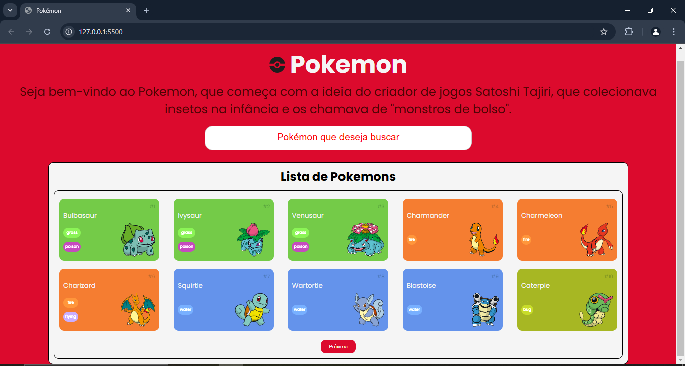
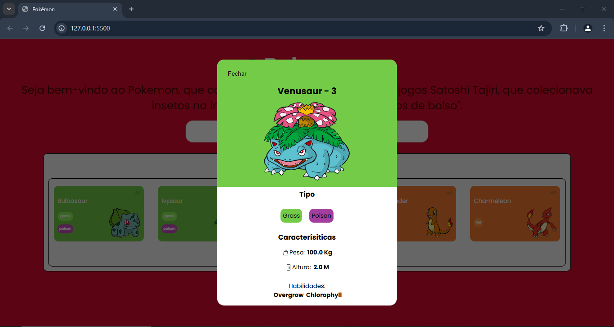
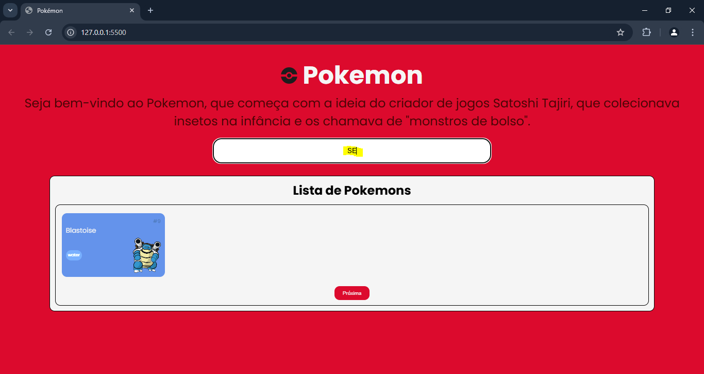
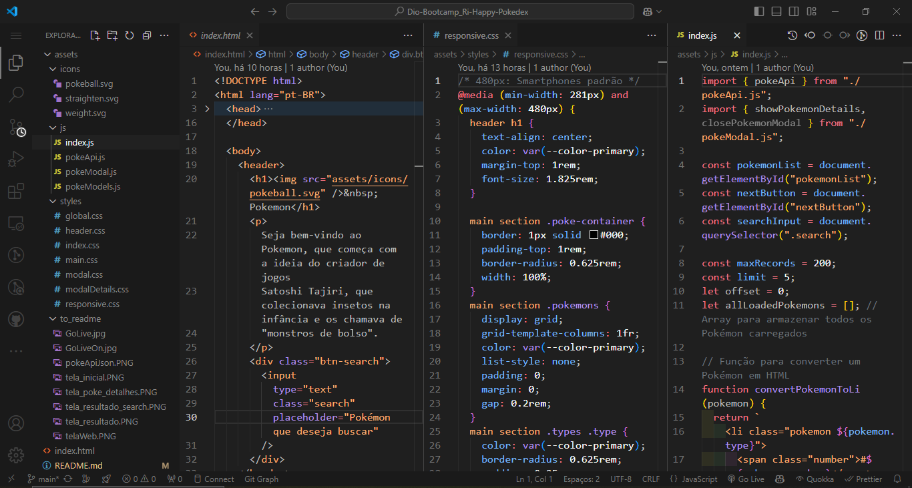
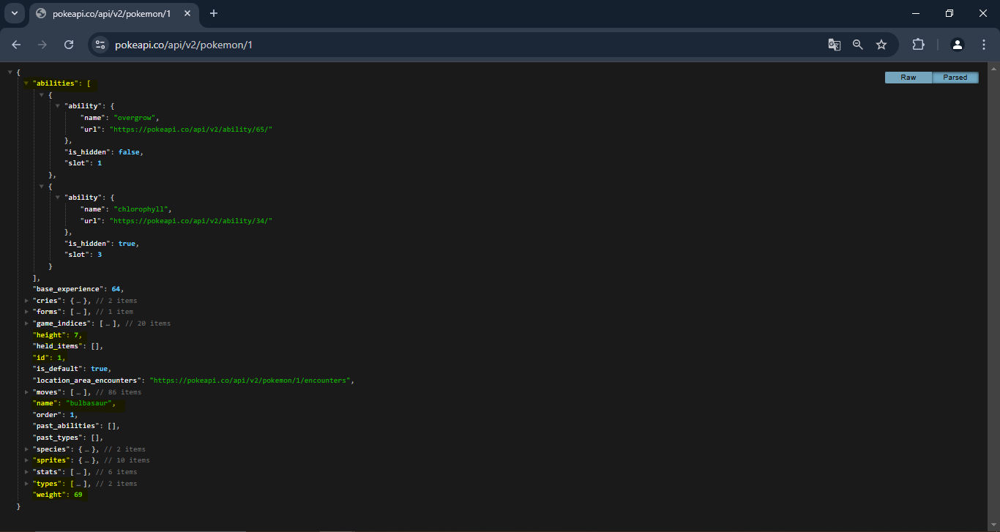
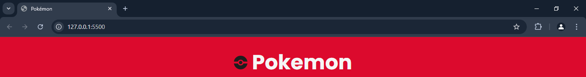

# Dio-Bootcamp_Ri-Happy-Pokedex

Este projeto é uma Pokédex interativa desenvolvida como parte do Dio Bootcamp Ri-Happy. O objetivo principal é explorar a lógica de programação em JavaScript para criar uma experiência dinâmica e divertida. A aplicação utiliza a PokéAPI para listar e exibir detalhes dos Pokémon, incluindo a possibilidade de buscar por nome e visualizar informações detalhadas em um modal. Este projeto combina manipulação de DOM, eventos e consumo de APIs para criar uma aplicação funcional e envolvente.

## Página de registro das informações sobre os Pokémons no mundo fictício da série

### 📜 Sobre o Projeto

O objetivo deste projeto é desenvolver uma página interativa para exibir informações dos Pokémon, utilizando dados fornecidos pela PokéAPI. O desafio consiste em criar uma aplicação dinâmica com as seguintes funcionalidades:

- Listar os Pokémon dinamicamente com base nos dados da API.
- Implementar um sistema de busca por nome, permitindo filtrar os Pokémon na lista.
- Exibir detalhes de cada Pokémon selecionado em um modal interativo.
- Navegar entre páginas utilizando paginação para exibir uma quantidade limitada de Pokémon por vez.
- Proporcionar uma experiência envolvente, com uma interface intuitiva e responsiva.

### 🔗 Links Úteis

- 

- 

### ✅ Status do Projeto

**Em Desenvolvimento**

### 🎥 Deploy

https://ricardo-werner.github.io/Dio-Bootcamp_Ri-Happy-Pokedex/

#### Tela da Página do Pokedex

  

#### Tela da Página com Resultado da lista de Pokémons

  

#### Tela da Página de detalhes do Pokémon

  

#### Tela da Página com o resultado da busca por Pokémon (apenas faz a busca pelos cards da lista)

  

#### Tela do código do Pokedex

  

#### Tela do arquivo JSON da POKEAPI

  

### 🧩 Desafio

O desafio deste projeto foi desenvolver uma Pokédex interativa, aplicando os conhecimentos adquiridos em JavaScript. O objetivo era criar uma aplicação dinâmica que consumisse a PokéAPI para exibir informações dos Pokémon, permitindo interação com o usuário por meio de:

- Busca por nome para filtrar Pokémon na lista.
- Exibição de detalhes em um modal ao selecionar um Pokémon.
- Paginação para navegação entre os dados disponíveis.
- Manipulação do DOM para criar e atualizar os elementos da interface dinamicamente.
- O projeto destacou a importância de integrar consumo de API, manipulação de eventos e boas práticas de programação.

### 📝 Requisitos da Aplicação

| Item  | Descrição                                                                       |
|-------|---------------------------------------------------------------------------------|
|  1    | A página deve ser desenvolvida em HTML, CSS e Javascript                        |
|  1.1  | Base de design: https://www.figma.com/community/file/979132880663340794         |
|  2    | Modelagem do layout, formatos, tipografias, cores e organização livre.          |
|  2.1  | Opcional: Modelagem de modo livre.                                              |
|  3    | A página deve consumir a api POKEAPI                                            |
|  4    | Lista dos Pokémons deve ser dinâmica                                            |
|  5    | Adicionar uma forma de apresentar os detalhes extra dos Pokémons                |
|  XX   | Adicionado busca dinâmica por Pokémon (desde que esteja na lista em tela)       |

### 🚀 Plano do Projeto

No desenvolvimento desta página, foram aplicados os seguintes conceitos:

| Item  | Descrição                                   |
|-------|---------------------------------------------|
|  1    | HTML                                        |
|  2    | CSS                                         |
|  3    | Javascript                                  |

### 🛠 Tecnologias Utilizadas

- **Visual Studio Code**
- **HTML**
- **CSS**
- **Javascript**
- **Documentação**
- **ChatGpt**

### 💡 Reflexões

Desenvolver este projeto foi um marco significativo no meu aprendizado na programação, permitindo um aprofundamento prático nas técnicas de desenvolvimento web. Durante este desenvolvimento, pude iniciar o meu entendimento em JavaScript, explorando sua capacidade de adicionar interatividade e dinamismo à página. Além disso, este projeto reforçou minha habilidade em manipulação de dados, lógica de programação e integração com APIs, contribuindo para meu crescimento contínuo na jornada como desenvolvedor.

### 📦 Como Executar o Projeto

1. Clone o repositório:
   
    git clone https://github.com/ricardo-werner/Dio-Bootcamp_Ri-Happy-Pokedex.git

3. Abra o projeto no Visual Studio Code e ative o Go Live:
    
   

     
   

   

     
   

4. Visualize o resultado na página web:

   

     
   

### 🙋‍♂️ Autor
Ricardo Werner 
Dev em Desenvolvimento
